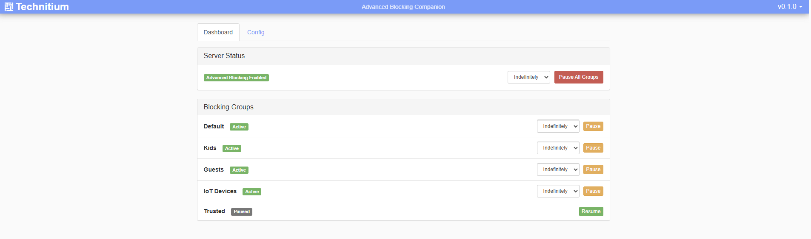
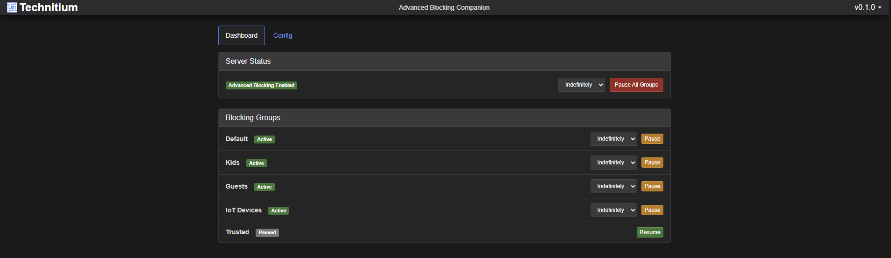
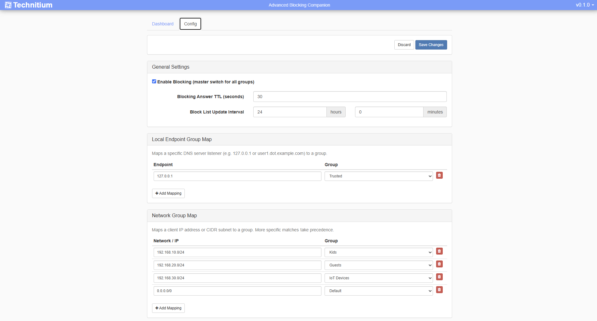
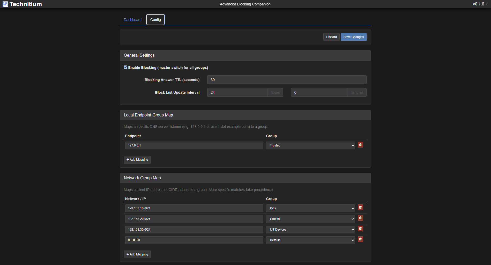
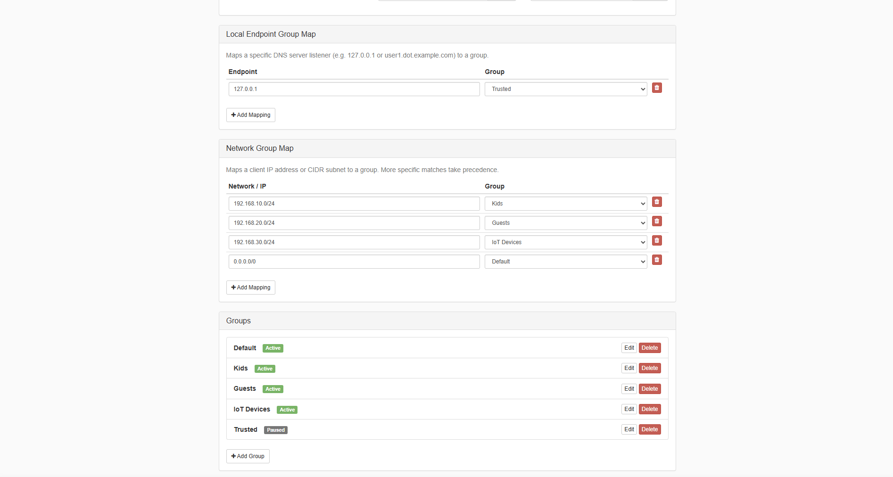
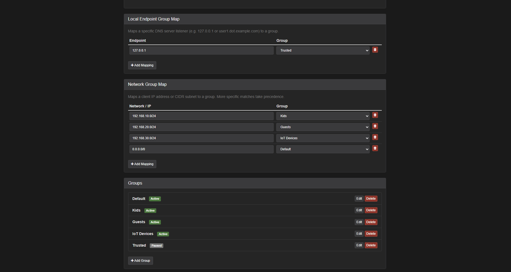

# TDNS-AdvAppConfig

A companion addon for [Technitium DNS Server](https://technitium.com/dns/) that gives the **Advanced Blocking** DNS app a proper web UI: pause/resume controls (with optional timers) and a form-based config editor, instead of hand-editing its raw JSON in the official web console.

The official web console only exposes Advanced Blocking's config as a raw JSON textarea (Apps > Advanced Blocking > Config). There's no button to quickly pause blocking, and no form to edit groups, block lists, or endpoint/network mappings. This addon adds a small web page, styled to match the Technitium console (same CSS, header, and theme switcher), that covers both.

See [CHANGELOG.md](CHANGELOG.md) for what's changed in each release.

## Screenshots

| Dashboard (light) | Dashboard (dark) |
| --- | --- |
|  |  |

| Config tab — general settings (light) | Config tab — general settings (dark) |
| --- | --- |
|  |  |

| Config tab — endpoint/network maps and groups |
| --- |
|  |
|  |

## Roadmap

Right now this only covers the **Advanced Blocking** app. The plan is to generalize it to any app in the Technitium App Store that's configured via a JSON document (Query Logs, DNS64, Split Horizon, Failover, and the rest) — same idea: a proper form-based editor instead of hand-editing raw JSON, wherever an app's config is just a JSON blob behind a textarea in the official console.

## How it works

The addon runs alongside Technitium DNS Server (on the primary node if clustered, or on the standalone server) and talks to the DNS Server's own HTTP API using an `Authorization: Bearer <token>` header:

- `GET api/apps/config/get?name=Advanced Blocking` — reads the current config
- `POST api/apps/config/set` — writes the config back (whole document replace)

Technitium reinitializes the app immediately on `config/set` — no restart needed, and if the server is a cluster primary, it automatically propagates the change to secondary nodes.

**Cluster note:** point this addon at whichever node is currently primary. The DNS Server only fans out config changes to secondaries when the change is made on the primary.

## Requirements

- A Technitium DNS Server with the **Advanced Blocking** app installed
- An API token (Settings > Users > create/select a user > Create API Token) with **Apps: View + Modify** permission
- No .NET installation needed on the host — releases are self-contained per platform

## Configuration

Copy `config.example.json` to `config.json` next to the executable and edit it:

```json
{
  "serverUrl": "http://127.0.0.1:5380",
  "token": "your-api-token",
  "adminSecret": "choose-a-long-random-shared-secret",
  "listenPort": 8099,
  "gitHubRepo": "Hemsby/TDNS-AdvAppConfig",
  "ignoreSslErrors": false
}
```

| Field | Description |
| --- | --- |
| `serverUrl` | Base URL of the Technitium DNS Server web API (the primary node) |
| `token` | API token with Apps permission |
| `adminSecret` | Shared secret required to use this addon's own web UI/API (see Security below) — required, the addon won't start without it |
| `listenPort` | Port this addon's own web page listens on |
| `gitHubRepo` | Repo used for the "check for updates" feature |
| `ignoreSslErrors` | Set true only if the DNS Server uses a self-signed cert you can't otherwise trust |

## Security

- **Shared-secret login.** This addon's own API requires `Authorization: Bearer <adminSecret>` on every `/api/*` call — without it, anyone who could reach the port would have unauthenticated control over blocking (and, via the config editor, the ability to redirect any domain to an arbitrary IP), since `token` above grants Apps:Modify on the real DNS server. The page shows a login overlay on first load (or if the stored secret is wrong/missing) asking for `adminSecret`; once entered, it's kept in the browser's `localStorage` and attached to every request automatically. The comparison is constant-time to avoid leaking the secret's content through response-timing differences.
- **Config validation before forwarding.** `POST /api/config/raw` (used by the Config tab's Save) validates the document's structure and types locally before forwarding it to the DNS server — required fields present, correct types, no null/duplicate group names, `blockListUrls`/`regexBlockListUrls`/`adblockListUrls` entries shaped correctly. A malformed submission is rejected with a specific error instead of reaching Technitium and potentially breaking the Advanced Blocking app until it's hand-fixed via the official console.
- **Run it as a dedicated unprivileged user**, not root — see the systemd unit above. `config.json` holds a Technitium API token in plaintext; keep it `chmod 600` and owned by that user on every deployment.
- **No TLS on the addon's own page** — it's meant for a trusted LAN, same as most self-hosted admin tools. Put it behind a reverse proxy with TLS if you need to reach it over an untrusted network.

## Getting a build

Once a `v*` tag is pushed, `.github/workflows/release.yml` builds and publishes `TDNS-AdvAppConfig-{win-x64,linux-x64,linux-arm64}.zip` to [the repo's Releases page](https://github.com/Hemsby/TDNS-AdvAppConfig/releases) — grab the zip matching your platform from there.

## Deployment

### Linux / systemd

```bash
useradd --system --no-create-home --shell /usr/sbin/nologin tdns-advappconfig

mkdir -p /opt/tdns-advappconfig
# extract the linux-x64 (or linux-arm64) release zip into /opt/tdns-advappconfig
cp config.example.json /opt/tdns-advappconfig/config.json   # then edit it (see Configuration below)
chmod +x /opt/tdns-advappconfig/TdnsAdvAppConfig

chown -R tdns-advappconfig:tdns-advappconfig /opt/tdns-advappconfig
chmod 600 /opt/tdns-advappconfig/config.json

cp deploy/systemd/tdns-advappconfig.service /etc/systemd/system/
systemctl daemon-reload
systemctl enable --now tdns-advappconfig
```

**`Restart=always` is required** (not `on-failure`) — both the self-update feature and a timed pause that outlives the process rely on the service restarting cleanly.

**Runs as a dedicated unprivileged user, not root** — the unit file sets `User=tdns-advappconfig` plus `ProtectSystem=strict`/`ProtectHome=true`/`ReadWritePaths=/opt/tdns-advappconfig`, since the addon only ever needs network access to Technitium's API and read/write access to its own install directory. `config.json` holds a Technitium API token in plaintext, so it's owned by that user and `chmod 600` — restrict it the same way on any deployment, including if you install this by hand instead of following the steps above.

### Windows

Extract the `win-x64` release zip anywhere, then copy `config.example.json` to `config.json` in that same folder and edit it. `TdnsAdvAppConfig.Updater.exe` must stay in the same folder as `TdnsAdvAppConfig.exe` — it's the helper that swaps files during a self-update (Windows locks a running executable's file, so the main process can't overwrite itself; this tiny helper waits for it to exit, copies the new files in, and relaunches it).

**Installing as a Windows Service (recommended)** — from an **elevated** (Administrator) PowerShell prompt, in that same folder:

```powershell
.\install-service.ps1
```

This registers a service named `TdnsAdvAppConfig` (automatic startup, restarts itself on crash — the closest Windows equivalent to the Linux deployment's `Restart=always`). Manage it with the standard service cmdlets:

```powershell
Start-Service TdnsAdvAppConfig
Stop-Service TdnsAdvAppConfig
Restart-Service TdnsAdvAppConfig
Get-Service TdnsAdvAppConfig
```

(or via `services.msc` / Task Manager's Services tab, same as any other Windows Service). To remove it: `.\uninstall-service.ps1` (also elevated).

When running as a service, self-update stays service-aware: after swapping files, the Updater helper restarts it via `sc start` (through the Service Control Manager) instead of launching the exe directly — so it doesn't end up as an orphaned process while Windows still shows the service as Stopped.

**Running without installing as a service** is also fine for quick testing — just run `TdnsAdvAppConfig.exe` directly from a terminal (closing the terminal stops it).

### Docker

Not yet packaged as an image. If you run it in a container yourself, be aware the in-app "Update" button is informational only for Docker (see below) — binaries inside a container aren't meant to self-modify.

## Dashboard tab

- A root status badge ("Advanced Blocking Enabled" / "Advanced Blocking Disabled for All Groups") with a **Pause All Groups** / **Resume All Groups** button. This toggles the app's root `enableBlocking` flag, which overrides every group regardless of their individual setting.
- Each group gets its own **Pause** / **Resume** button, toggling that group's `enableBlocking` flag independently. While the root switch is off, the group list still shows each group's own state with a note that they're currently overridden.
- **Timed pause:** the Pause button (root or per-group) has a duration dropdown — Indefinitely, 5/15/30 min, 1 hour, or **Custom…** (a number input plus a minutes/hours picker, for things like "1 minute" or "3 hours"). A timed pause shows a live "resumes in MM:SS" countdown with a "Resume Now" option.
  - The timer lives server-side (not just in the browser tab), so it still fires and auto-resumes blocking even if no browser is open.
  - It's persisted to `pause-timers.json` (next to `config.json`), so a restart — a crash, or the addon's own self-update — doesn't silently lose a pending auto-resume; it's reloaded and honored on startup.
  - While you're actively picking a custom duration, the periodic status refresh pauses itself so it doesn't wipe out what you're typing.

## Config tab

A full form-based editor for the Advanced Blocking config document — no raw JSON required:

- **General settings**: blocking answer TTL, block list update interval.
- **Local endpoint group map** / **network group map**: key-value editors where the group is a dropdown (can't accidentally reference a group that doesn't exist). Keys can be renamed inline.
- **Groups**: add, rename, and delete groups. Renaming a group automatically updates any endpoint/network map entries that pointed at the old name.
- **Per-group editor** covering every field: toggles (enable blocking, TXT blocking report, block-as-NXDOMAIN), blocking addresses, allowed/blocked domains, allow list URLs, and block list URLs (with an "Advanced" toggle per URL for the `blockAsNxDomain`/`blockingAddresses` override), plus the regex and adblock-list equivalents.
- A single **Save Changes** / **Discard** pair at the top — edits are held in memory until you save, with an unsaved-changes indicator and a warning if you try to close the tab with pending changes.

## Look and feel

The page vendors Technitium's own web console assets (`bootstrap.min.css`, `main.css`, `dark-mode.css`, `amber-mode.css`, `font-awesome`, favicon, logo) for visual parity — same header bar, same tab styling, same theme mechanism.

The header's options menu (top right, next to the version number) has:
- **Check for updates** / **Update now** (see below)
- **Theme**: Auto / Light / Dark / Amber — mirrors the official console exactly (a class on `<body>`, persisted in `localStorage`, following your system preference when set to Auto)

## Self-update

The options menu shows the current version with a "Check for updates" link. If a newer GitHub release exists:

- **Linux/systemd:** downloads the new build, replaces the files in place, and exits — systemd's `Restart=always` brings it back up on the new version.
- **Windows:** downloads the new build, hands off to `TdnsAdvAppConfig.Updater.exe` (which waits for the main process to exit, swaps the files, and relaunches it).
- **Docker:** the "Update" button reports that Docker deployments should be updated via `docker compose pull && docker compose up -d` on the host instead.

## Known limitations

- No multi-node config / auto primary-detection — you point it at one server URL, which must be the primary if clustered.
- Docker has no one-click update path yet.
